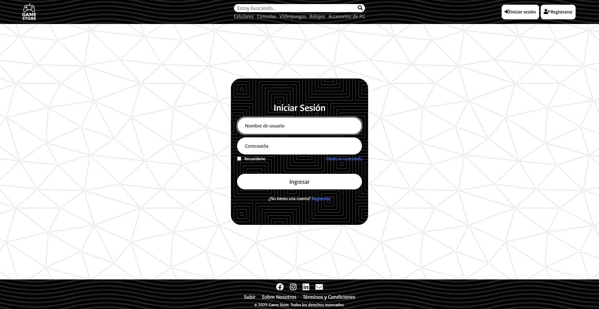
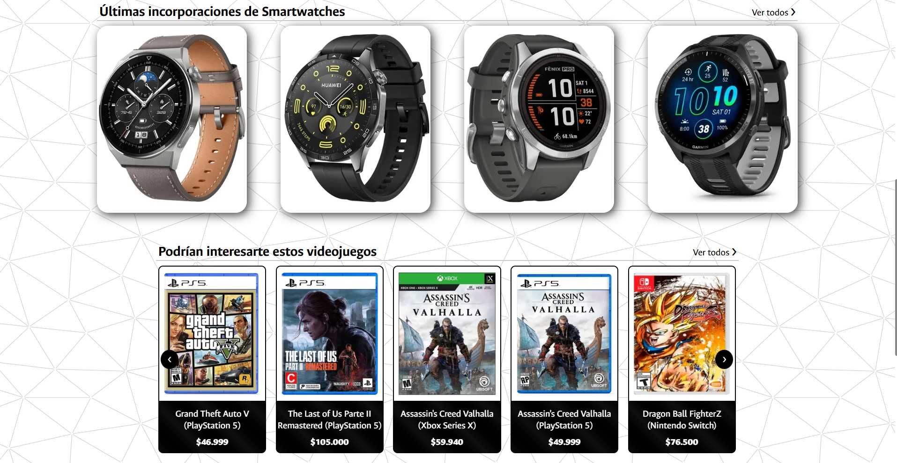
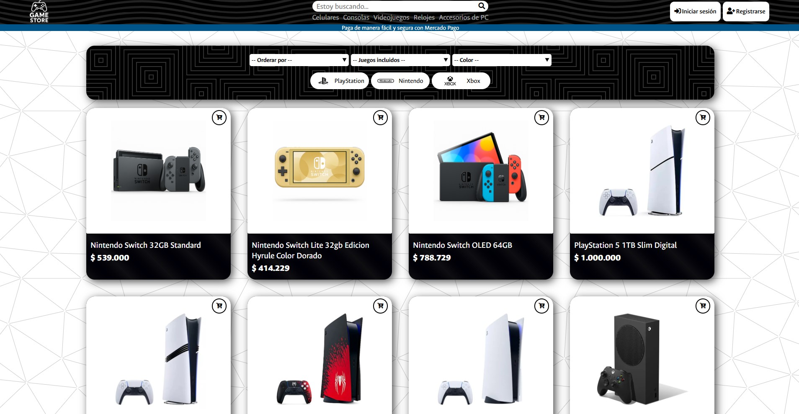
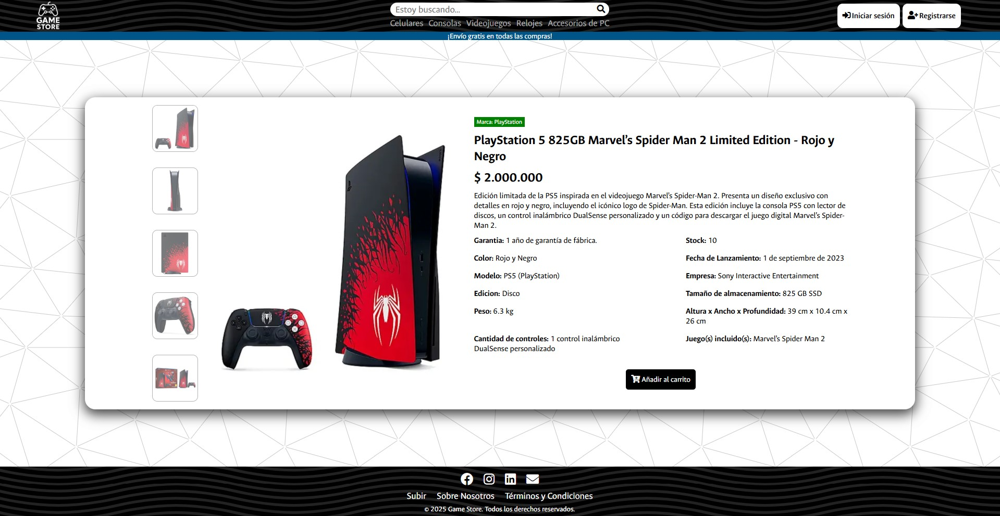
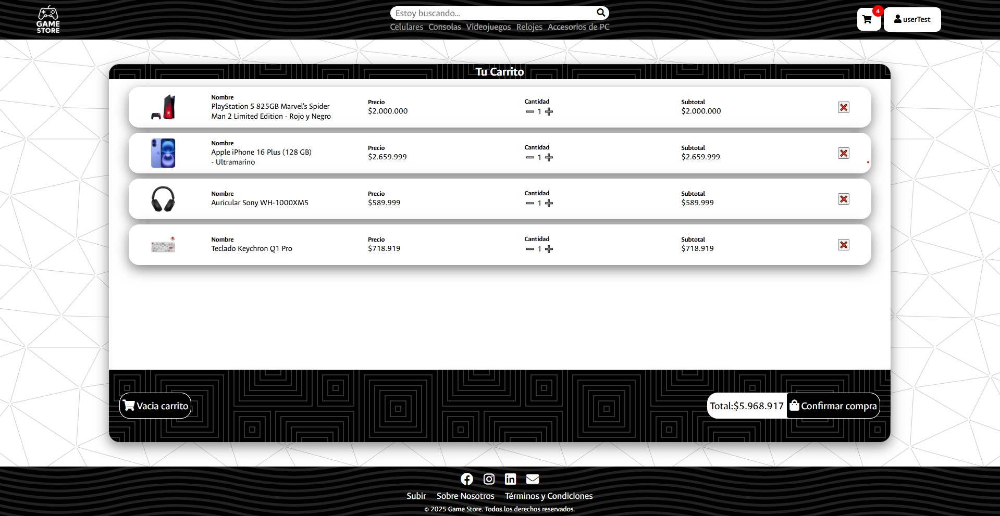
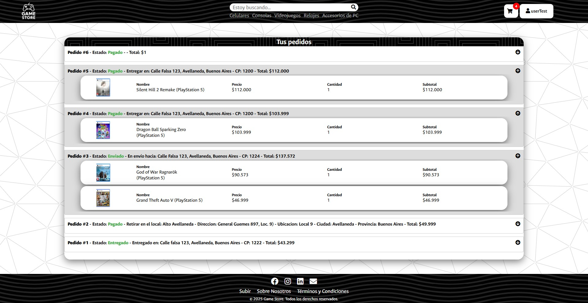
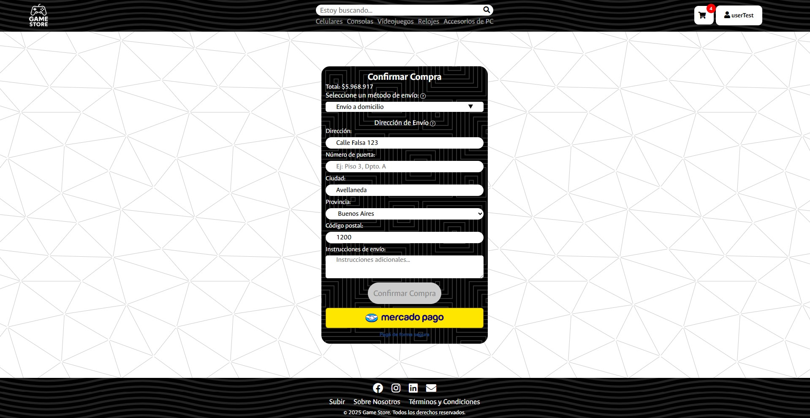

# 🕹️ Game Store - Sistema E-commerce en Django

**Game Store** es una plataforma e-commerce desarrollada con **Django**, que permite comprar videojuegos, consolas, celulares, relojes inteligentes y accesorios de PC. Incluye un sistema completo de carrito, pedidos, usuarios, retiro en tiendas físicas, direcciones de envío, control de stock, , pagos con MercadoPago, y filtros dinámicos para facilitar la navegación.

---

## 🧰 Funcionalidades Principales

### 🧍 ** Gestión de Usuarios ("Aplicación Usuarios") **
  - Sistema de usuarios personalizado (`CustomUser`).
  - Asociación de usuarios con los modulos de Pedido, DireccionEnvio y Carrito.

### 🏠 ** Página Principal **
- Muestra una selección aleatoria de productos variados.

- Visualización destacada de los últimos relojes agregados y productos recomendados por categoría (juegos, celulares, accesorios).

- Totalmente dinámica: se actualiza con cada nuevo producto agregado.

### 🎮 ** Tienda ("Aplicación Tienda") **
  - Incluye cinco categorías principales:
    - Videojuegos
    - Consolas
    - Celulares
    - Relojes Inteligentes
    - Accesorios de PC
  - Cada sección cuenta con:
    - Filtros por marca, tipo, color, consola/plataforma, género, almacenamiento, juegos incluidos, etc.
    - Ordenamiento por precio o nombre (ascendente y descendente).
    - Vista de detalle con información ampliada.

### 🛒 ** Carrito de Compras ("Aplicación Carrito") **
  - Permite agregar productos desde distintas categorías al carrito (videojuegos, consolas, celulares, relojes inteligentes y accesorios de PC).
  - Uso de `GenericForeignKey` para gestionar múltiples tipos de productos en una única estructura de carrito (`LineaCarrito`).
  - Reserva de stock automática que reserva los productos por usuario durante 15 minutos mediante un modelo de `ReservaStock`.
  - Confirmación de pedidos con elección de envío o retiro en tienda.    

### 📦 ** Sistema de Pedidos **
  - Los pedidos pueden tener estado (enviado, cancelado, etc.).
  - Las reservas de stock se vinculan con el pedido para asegurar la disponibilidad.
  - Gestión de pedidos por usuario.
  - Confirmación de pedidos y vinculación con direcciones de envío o retiro por sucursal.

### 💳 ** Integración con MercadoPago **
  - Integración completa con la API oficial de MercadoPago (`Checkout Pro`):
  - Excluye métodos como pago en efectivo o cajero (atm, ticket).    
  - Se crea el objeto `Pedido` y se registran las líneas (`LineaPedido`).
  - Limpieza completa del carrito y de las sesiones tras el pago exitoso.

---

## 🧩 Apps del Proyecto

| App          | Propósito                                                                |
|--------------|--------------------------------------------------------------------------|
| `usuarios`   | Usuarios personalizados, autenticación, datos extra                      |
| `carrito`    | Carrito, pedidos, direcciones, stock                                     |
| `tienda`     | Modelos para consolas, juegos, celulares, smartwatches y accesorios      |

---

## 🧠 Tecnologías Utilizadas

| Tecnología       | Descripción                                      |
|------------------|--------------------------------------------------|
| Django           | Framework backend principal                      |
| SQLite           | Base de datos por defecto para desarrollo        |
| HTML/CSS         | Maquetación responsive y diseño visual adaptable. |
| JavaScript       | Funcionalidades personalizadas del lado del cliente. |
| MercadoPago SDK  | Integración de pasarela de pago con checkout automático. |
| ContentType / GenericForeignKey	  | Sistema flexible para manejar múltiples tipos de productos en el carrito y pedidos. |

---
> ⚠️ **Advertencia de Seguridad:**
> Este proyecto utiliza integración con Mercado Pago para gestionar pagos en línea. **Las credenciales `ACCESS_TOKEN` y `PUBLIC_KEY` deben ser reemplazadas por tus propias claves de prueba o producción**, dependiendo del entorno. (Estas se encuentran en  game_store/settings.py)
> Estas credenciales son provistas por Mercado Pago para pruebas en modo "sandbox" (no involucran dinero real).
> Además, para que la integración de Mercado Pago funcione correctamente en producción, es necesario contar con un dominio real con HTTPS habilitado, ya que Mercado Pago requiere un sitio accesible públicamente y seguro para procesar transacciones. Sin embargo, para realizar pruebas en el entorno de desarrollo, puedes utilizar ngrok para exponer tu servidor local a un dominio temporal con HTTPS, lo que permite simular el entorno de producción sin necesidad de un dominio real.

> **Admin de testeo:**
> User: `adminTest`
> Password: `Admin45912`

> **User de testeo:**
> User: `userTest`
> Password: `User45912`

